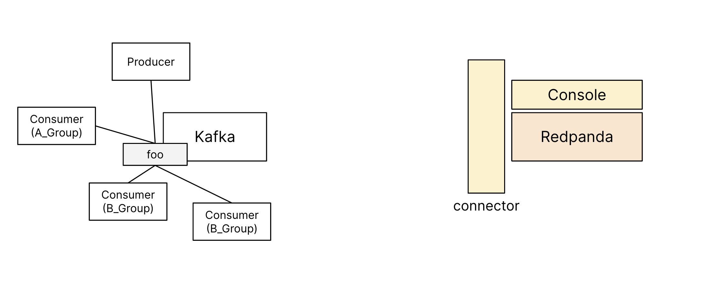
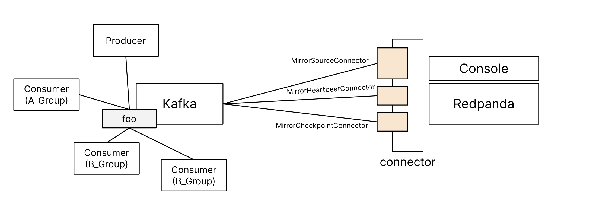
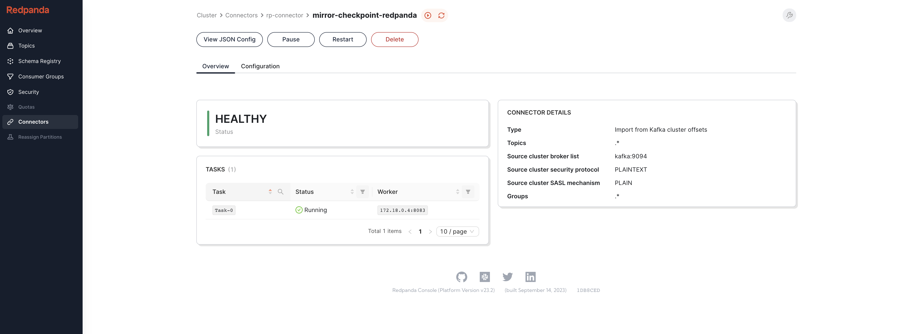
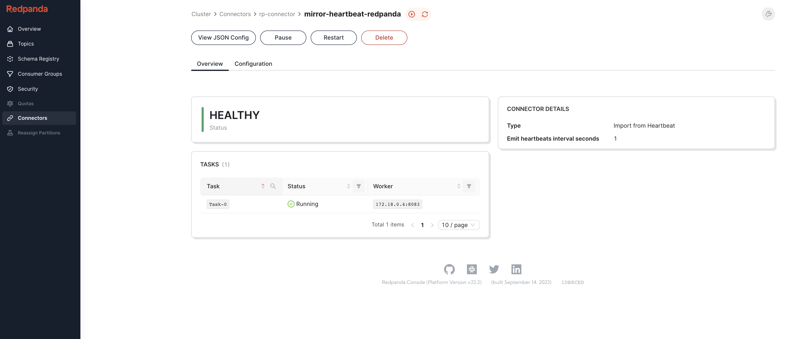
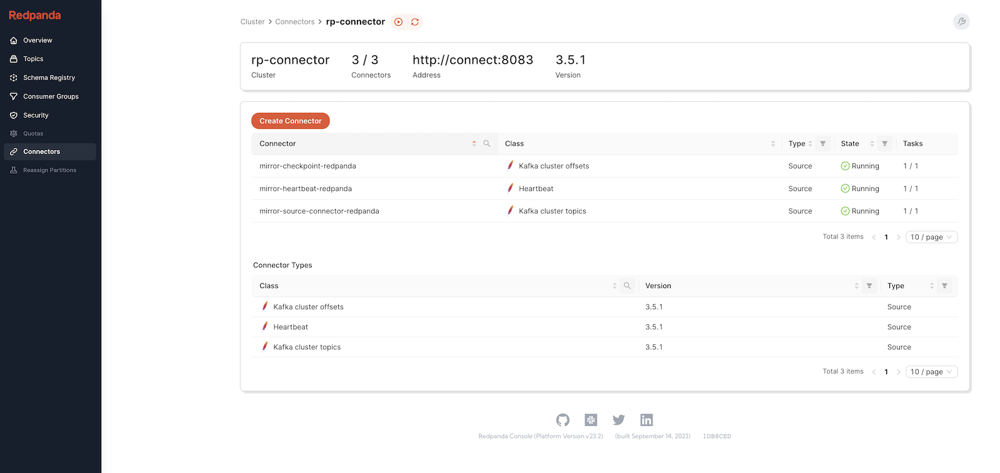
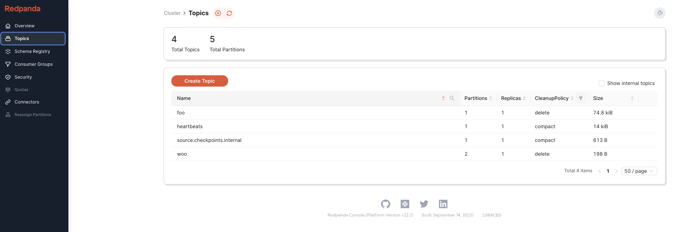
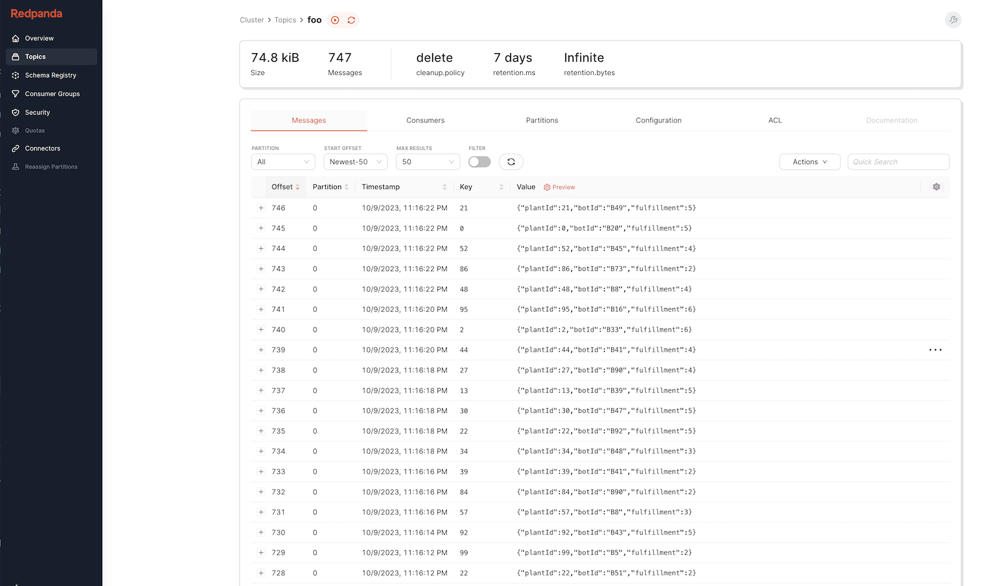
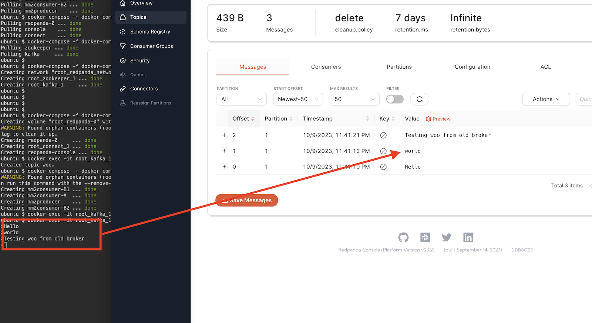

### Start the Redpanda cluster
There are several ways to set up Redpanda; in this lab, we'll focus on using the Docker images. You can quickly get Redpanda clusters up and running with Docker Compose or Kubernetes.

Take a peek at the docker-compose-rp.yaml file to see the services you'll be deploying:
```
cat docker-compose-rp.yaml
```{{exec}}


Inside, you'll find three services:

**redpanda-0** : This is the broker's name. In this lab, because of limited resources, we're just spinning up a single broker. But remember, in a real-world setup, you'd have multiple brokers for high availability, fault tolerance, and better scaling.

**redpanda-console**: This links to the Redpanda Console, which is the official UI for Redpanda.

**connect**: This Docker image is used to set up managed connectors for Redpanda.




Alright, it's time to get these services going. Kick them off with the following command:
```
docker-compose -f docker-compose-rp.yaml up -d 
```{{exec}}

Please be patient for a moment. You'll know it's done when you see:

```
Creating redpanda-0     ... done
Creating root_connect_1 ... done
Creating redpanda-console ... done
```
Click on [Redpanda Console]({{TRAFFIC_HOST1_8080}}/) and access it via your browser. In the Topics page, you should see nothing is created indicating this is an empty cluster.

### Provision Mirror Maker 2

Now that the Redpanda cluster is up and running, we can now go ahead and start the migration. MirrorMaker 2.0 (MM2) brings in the idea of connectors to make migrating from Kafka to Redpanda clusters a breeze.

Let's go ahead and set up the 3 connectors:
- MirrorSourceConnector 
- MirrorCheckpointConnector 
- MirrorHeartbeatConnector 



 In to the [Redpanda Console]({{TRAFFIC_HOST1_8080}}/), on the left menu, tap on _connector_. Ready to set up your first connector? Click the _Create Connector_ button at the top of the page and pick "import data from Kafka cluster topics" on the next screen. This will lead you to configure the **MirrorSourceConnector**.

The **MirrorSourceConnector** is your go-to for copying data from your source Kafka cluster to the Redpanda cluster. It consumes records from source topics on the source cluster and then produces them to the corresponding mirrored topics on the target cluster. It also takes care of offset translation between source and target topics so that it can provide exactly-once delivery semantics.

Move past the wizard page (It's alright to leave the fields in configuration form empty, we will be overwriting those in the next step), and hit **Next**. In the *Connector Properties* section, overwrite the existing content with the following:

```
{
    "connector.class": "org.apache.kafka.connect.mirror.MirrorSourceConnector",
    "name": "mirror-source-connector-redpanda",
    "offset-syncs.topic.replication.factor": "-1",
    "key.converter": "org.apache.kafka.connect.converters.ByteArrayConverter",
    "value.converter": "org.apache.kafka.connect.converters.ByteArrayConverter",
    "replication.factor": "-1",
    "replication.policy.class": "org.apache.kafka.connect.mirror.IdentityReplicationPolicy",
    "security.protocol": "PLAINTEXT",
    "source.cluster.alias": "source",
    "source.cluster.bootstrap.servers": "kafka:9094",
    "source.cluster.sasl.mechanism": "PLAIN",
    "source.cluster.security.protocol": "PLAINTEXT",
    "sync.topic.acls.enabled": "false",
    "sync.topic.configs.enabled": "true",
    "target.cluster.bootstrap.servers": "redpanda-0:9092",
    "topics.exclude": ".*[\\-\\.]internal,.*\\.replica,__consumer_offsets,_redpanda_e2e_probe,__redpanda.cloud.sla_verification,_internal_connectors.*,_schemas"
}
```{{copy}}

Hit **Create** to start the connector, you should be able to see the connector's status:


Next, go back to the connector page by clicking on the left menu, tap on _connector_. Repeat the process of clicking on the _Create Connector_ button but this time pick " import data from Kafka cluster offsets" on the next screen. This will lead you to configure the **MirrorCheckpointConnector**.

**MirrorCheckpointConnector**  manages checkpoints, it periodically consumes from all internal MM2 topics on the target cluster and emits checkpoints to the an mm2-offset-checkpoints topic. These checkpoints are essential to translating offsets between source and target clusters, which is essential for failover.

Move past the configuration wizard page (Again, ignore the empty fields, we will overwrite it in the following step), and hit **Next**. In the _Connector Properties_ section, overwrite the existing content with the following:
```
{
    "connector.class": "org.apache.kafka.connect.mirror.MirrorCheckpointConnector",
    "name": "mirror-checkpoint-redpanda",
    "key.converter": "org.apache.kafka.connect.converters.ByteArrayConverter",
    "value.converter": "org.apache.kafka.connect.converters.ByteArrayConverter",
    "source.cluster.alias": "source",
    "source.cluster.bootstrap.servers": "kafka:9094",
    "target.cluster.alias": "target",
    "target.cluster.bootstrap.servers": "redpanda-0:9092"
}
```{{copy}}

Hit **Create** to start the connector, you should be able to see the connector's status:


Repeat last step to create the **MirrorHeartbeatConnector**, make sure you select "import data from Heartbeat" when choosing the connector. 

*&MirrorHeartbeatConnector*& like it's name, it produces heartbeats to predefined topics on the source cluster. These heartbeats are replicated to the target cluster like regular data and can be used to measure replication latency and ensure that the replication is alive and well. 

Move past the configuration wizard page(Ignore the empty fields, we will overwrite it in the following step ), and hit **Next**. In the _Connector Properties_ section, overwrite the existing content with the following:
```
{
    "connector.class": "org.apache.kafka.connect.mirror.MirrorHeartbeatConnector",
    "name": "mirror-heartbeat-redpanda",
    "key.converter": "org.apache.kafka.connect.converters.ByteArrayConverter",
    "value.converter": "org.apache.kafka.connect.converters.ByteArrayConverter",
    "source.cluster.alias": "source",
    "source.cluster.bootstrap.servers": "kafka:9094",
    "target.cluster.alias": "target",
    "target.cluster.bootstrap.servers": "redpanda-0:9092"
}
```{{copy}}


Hit **Create** to start the connector, you should be able to see the connector's status:


Back in the connector page, your should see all three connector running:


Check yours topics again by select on the *Topics* on the left menu, you should see all the topics you created in the old kafka cluster replicated in the new Redpanda cluster.


Data should be replicated in the *foo* topic too. 


*OPTIONAL*

Let's manually insert data into the old kafka cluster's *woo* topic, in tab 2 launch producer back up:
```
docker exec -it root_kafka_1 kafka-console-producer --broker-list localhost:29094 --topic woo 
```{{exec}}

Try typing to send data to the *woo* topic using the producer. In tab 2 push few more message in the producer and see if they were replicated in Redpanda cluster.

Back in [Redpanda Console]({{TRAFFIC_HOST1_8080}}/), under *topics/woo* data should be replicated in the topic . 


Terminate the producer in tab 2 by pressing `Ctrl+C`.

