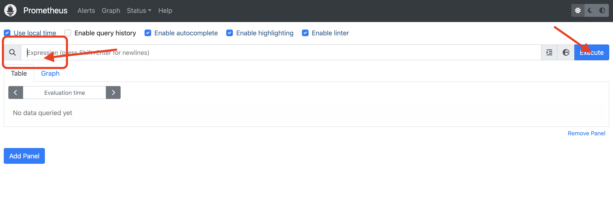
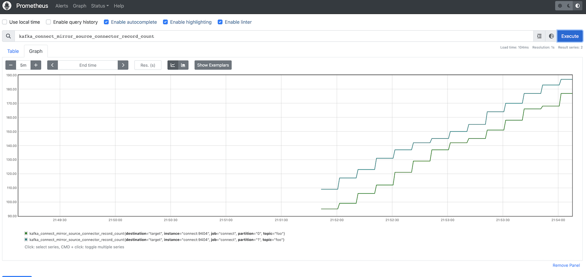
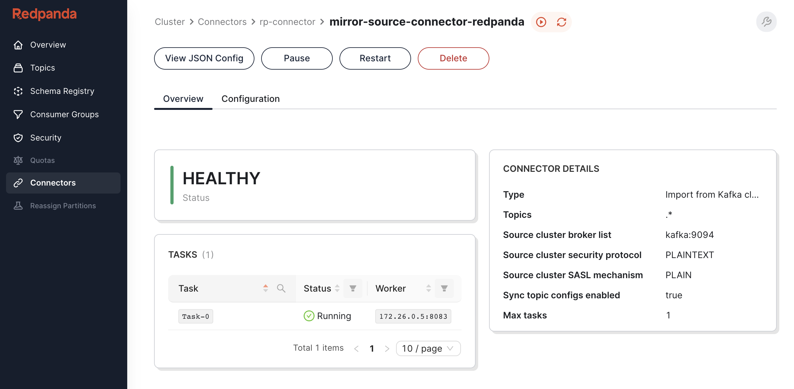
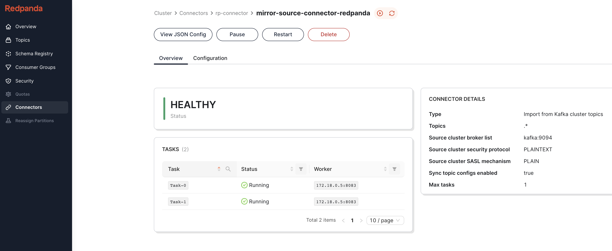

### Monitor MM2 performance - WIP
Monitoring MM2 metrics in real-time helps pinpoint replication delays instantly. This not only offers a clear perspective on potential hindrances but also assures the best migration pace and effectiveness. And it safeguards data integrity and system reliability, guaranteeing a successful migration without data loss or downtime.  Using Redpanda's connector, these performance metrics are automatically made available and can be seamlessly integrated with Prometheus.

Let's start the 
```
docker-compose -f docker-compose-prometheus.yaml up -d
```{{exec}}

> _*Note:*_ The *Redpanda Connect container* exports metrics and statistics from JMX by
default, this is available to a Prometheus collector on port 9404. 



There are two main metrics to notice:
- **kafka_connect_mirror_source_connector_replication_latency_ms_max**
- **kafka_connect_mirror_source_connector_record_count**

Go to [Prometheus]({{TRAFFIC_HOST1_9090}}/graph) and paste **kafka_connect_mirror_source_connector_replication_latency_ms_max** in the query box and click the _Execute_ button, here is what you will see:

For **kafka_connect_mirror_source_connector_replication_latency_ms_max**, you might not observe any immediate fluctuations. This is because, at the start, there's a surge in message count as the system copies accumulated data between clusters. However, as the replication continues, the Redpanda cluster gradually synchronizes, and the message count is expected to decline until it stabilizes at zero.

Paste **kafka_connect_mirror_source_connector_record_count** in the query box and click the _Execute_ button (change the query range to 5 mins if you want), here is what you will see :



**kafka_connect_mirror_source_connector_record_count**, you should see a rising trend as we persistently write to the source topic. However, during migration, any activity or fluctuations should cease once all producers have transitioned to the new Redpanda cluster.. 


### Adding more workers
You might be concerned about performance. What happens if my MM2 connector starts to lag? The solution is straightforward: simply increase the number of workers/tasks handling the replication.

To see how many tasks/workers are currently active, run the following command. It will display the tasks presently operating for the connector.
```
curl localhost:8083/connectors/mirror-source-connector-redpanda/tasks | jq
```{{exec}}

And further view a task/worker’s status.
```
curl localhost:8083/connectors/mirror-source-connector-redpanda/tasks/0/status | jq
```{{exec}}

Or you can simply see that in the Redpanda Console too:


Let's add another task/worker to our connector. Instead of using the console, we can achieve this through a straightforward API call, which will update the configuration for the existing connector. In this example we added maximum task to _2_. 

```
curl --location --request PUT 'localhost:8083/connectors/mirror-source-connector-redpanda/config' \
--header 'Content-Type: application/json' \
--data '{
    "connector.class": "org.apache.kafka.connect.mirror.MirrorSourceConnector",
    "name": "mirror-source-connector-redpanda",
    "offset-syncs.topic.replication.factor": "-1",
    "key.converter": "org.apache.kafka.connect.converters.ByteArrayConverter",
    "value.converter": "org.apache.kafka.connect.converters.ByteArrayConverter",
    "replication.factor": "-1",
    "replication.policy.class": "org.apache.kafka.connect.mirror.IdentityReplicationPolicy",
    "security.protocol": "PLAINTEXT",
    "source.cluster.alias": "source",
    "source.cluster.bootstrap.servers": "kafka:9094",
    "source.cluster.sasl.mechanism": "PLAIN",
    "source.cluster.security.protocol": "PLAINTEXT",
    "sync.topic.acls.enabled": "false",
    "sync.topic.configs.enabled": "true",
    "target.cluster.bootstrap.servers": "redpanda-0:9092",
    "topics.exclude": ".*[\\-\\.]internal,.*\\.replica,__consumer_offsets,_redpanda_e2e_probe,__redpanda.cloud.sla_verification,_internal_connectors.*,_schemas",
    "tasks.max": "2"
}'
```{{exec}}

### Add an aggressive producer 
To see the source connector activating both tasks or workers, initiate another producer that will intensively send messages to the Kafka topic: 
```
docker run -d --network=root_redpanda_network \
-e BOOTSTRAP_SERVERS='redpanda-0:9092' \
-e SLEEP_TIME=1 \
-e MAX_REC=10000 \
--name mm2producer \
weimeilin/mm2producer
```{{exec}}

In the Redpanda console, under the details for the **mirror-source-connector-redpanda** connector, you should now see that the connector has *two* active tasks to handle the increased traffic.



Terminate the aggressive producer pressing `Ctrl+C`.