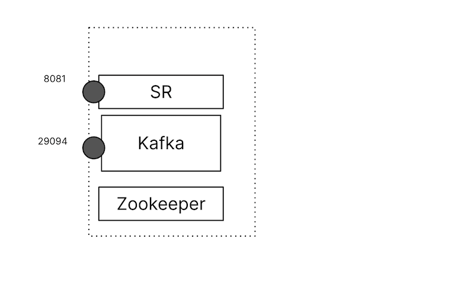
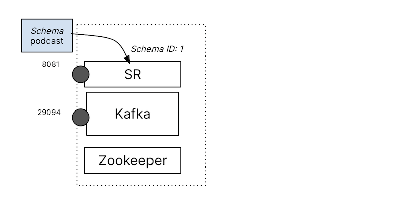
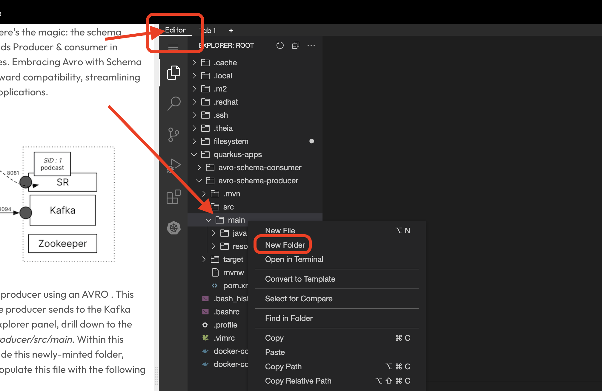
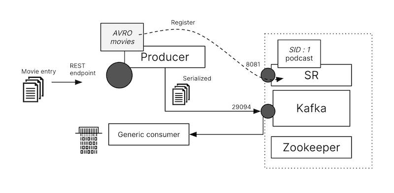

Welcome to the lab! Here, we'll dive into migrating your schema registry, shifting from Confluent to Redpanda. If you're curious about data replication to a new cluster, refer to this [lab](https://killercoda.com/redpanda/scenario/mm2-1-replication).


### Initial Environment
Give it a minute to setup, let's first get a feel for our environment. Fire this up:
```
docker ps --format '{{.Names}} {{.Ports}}'
```{{exec}}



You should notice three running components - a Kafka broker, Zookeeper, and the Confluent schema registry. 
```
rroot_schemaregistry_1 0.0.0.0:8081->8081/tcp, :::8081->8081/tcp
root_kafka_1 0.0.0.0:9094->9094/tcp, :::9094->9094/tcp, 9092/tcp, 0.0.0.0:29094->29094/tcp, :::29094->29094/tcp
root_zookeeper_1 2888/tcp, 3888/tcp, 0.0.0.0:22181->2181/tcp, :::22181->2181/tcp
```

Before making any move, let’s first check out the current state of our Confluent Schema Registry. The initial step? Ensuring if it has any registered schemas:

To check if the registry is empty, use the following command to call the API on the registry:

```
curl -X GET http://localhost:8081/subjects
```{{exec}}


It fetches all subjects (or topics) for which schemas have been registered. If the output is an empty array [], your registry is empty.
```
[]
```
> _Note:_ If you see the `curl: (52) Empty reply from server` response, that means your registry is not ready yet, give it a minute and try the above request again.

While auto-registering a schema during topic publishing is feasible, we'll try the manual route first:

```
curl -X POST 'http://localhost:8081/subjects/podcast-value/versions' \
--header 'Content-Type: application/vnd.schemaregistry.v1+json' \
--data '{"schema": "{\"namespace\": \"org.demo\",\"type\": \"record\",\"name\": \"Movie\",\"fields\": [{\"name\": \"title\",\"type\": \"string\"},{\"name\": \"year\",\"type\": \"int\"},{\"name\": \"host\",\"type\": \"string\"}]}"}'
```{{exec}}



The registry should assign and schema id:
```
{"id":1}
```

Validate its registration with:
```
curl -X GET http://localhost:8081/subjects
```{{exec}}

You should be able to see it appears in the schema registry:
```
["podcast-value"]
```

### Start producer and register schema

Let's now try automatically register it by setup the producer, we will will use Quarkus, a popular Java framework, to set up our Kafka producer and integrate it with Avro schemas. If you're unfamiliar with Avro, it not only provides a compact and rich data structure but also good in its support for schema evolution. This means you can modify your data schema over time without worrying about breaking compatibility.

When Avro is coupled with Schema Registry, it ensures that producers and consumers have a unified understanding of the data format, which further guarantees data integrity and compatibility. Here's the magic: the schema registry will store our Avro schemas, and this aids Producer & consumer in efficiently serializing and deserializing messages. Embracing Avro with Schema Registry equips us with both backward and forward compatibility, streamlining the evolution of data models and associated applications.


Let's get started, we'll create a schema for the producer using an AVRO . This schema will then help serialize the data that the producer sends to the Kafka broker. Navigate to the editor tab. In the left explorer panel, drill down to the directory path _quarkus-apps/avro-schema-producer/src/main_. Within this directory, create a new folder named **avro**. Inside this newly-minted folder, create a file with the name **movie.avsc**. Now, populate this file with the following content:



```
{
  "namespace": "org.demo",
  "type": "record",
  "name": "Movie",
  "fields": [
    {
      "name": "title",
      "type": "string"
    },
    {
      "name": "year",
      "type": "int"
    }
  ]
}
```{{copy}}

After setting up the schema, take a moment to examine the producer. In the same editor tab and left explorer panel, navigate to the directory _quarkus-apps/avro-schema-producer/src/main/java/org/demo_. Here, open the **MovieResource.java** file. You'll observe that, upon initialization, it activates a REST endpoint designed to receive movie data entries, which are then dispatched to a Kafka endpoint named movies.

Click on the **+** icon at the top to add a new tab, labeled _tab 2_. In _tab 2_, and build the project

```
cd /root/quarkus-apps/avro-schema-producer/
./mvnw generate-resources install
```{{exec}}

> _Note:_ if you see any error, make sure you have _quarkus-apps/avro-schema-producer/src/main/avro/movie.avsc_ correctly created.

Initiate the producer:
```
./mvnw quarkus:run -Dquarkus.http.port=9090
```{{exec}}

As it starts, you will see the following prompt in the tab:
```
[io.quarkus] (main) avro-schema-producer 1.0.0-SNAPSHOT on JVM (powered by Quarkus 3.4.2) started in 6.259s. Listening on: http://0.0.0.0:9090
[io.quarkus] (main) Profile prod activated. 
[io.quarkus] (main) Installed features: [cdi, confluent-registry-avro, kafka-client, resteasy-reactive, resteasy-reactive-jackson, smallrye-context-propagation, smallrye-reactive-messaging, smallrye-reactive-messaging-kafka, vertx]
```



Click on the **+** icon at the top to add a new tab, labeled _tab 3_. In _tab 3_,Verify the data sent by consuming from topic _movies_, in create _tab 3_ run:
```
docker exec -it root_kafka_1 kafka-console-consumer --bootstrap-server localhost:29094 --topic movies 
```{{exec}}

In _tab 1_, send a movie entry:
```
curl --header "Content-Type: application/json" \
  --request POST \
  --data '{"title":"The Shawshank Redemption","year":1994}' \
  http://localhost:9090/movies
```{{exec}}

You'll notice an entry in _tab 3_ a default bash consumer, but it may not appear in the expected format. This is because the data has been serialized. To view it in the correct format, we'll need a consumer to deserialize the data:
```
0The Shawshank Redemption
```


Terminate the consumer process in _tab 3_ with `ctrl + C`, go to _tab 1_, let's check the Schema registry again:
```
curl -X GET http://localhost:8081/subjects
```{{exec}}

Since we turned on the auto-register in the producer cient, a new entry **movies-value** is added to the schema registry.
```
["movies-value","podcast-value"]
```

Let's see if the added schema in the registry matches with the one you created in the producer project?
```
curl -X GET http://localhost:8081/subjects/movies-value/versions/1 | jq
```{{exec}}

And it is, 
```
{
  "subject": "movies-value",
  "version": 1,
  "id": 1,
  "schema": "{\"type\":\"record\",\"name\":\"Movie\",\"namespace\":\"org.demo\",\"fields\":[{\"name\":\"title\",\"type\":{\"type\":\"string\",\"avro.java.string\":\"String\"}},{\"name\":\"year\",\"type\":\"int\"}]}"
}
```

### Start Consumer and download the schema

We'll need a consumer, our consumer will be grabbing the latest schema from the registry. Stay in _tab 3_, and build the consumer:
```
cd /root/quarkus-apps/avro-schema-consumer/
./mvnw process-resources install
```{{exec}}

> _Note_ to the Java developers, we are downloading the schema from service registry with step `process-resources`, and use it to generate the Movie class we use in the code.


 Initiate the consumer:
```
./mvnw quarkus:run -Dquarkus.http.port=9091
```{{exec}}

As it starts, you will see the following prompt in the tab:
```
[io.quarkus] (main) avro-schema-consumer 1.0.0-SNAPSHOT on JVM (powered by Quarkus 3.4.2) started in 3.051s. Listening on: http://0.0.0.0:9091
[io.quarkus] (main) Profile prod activated. 
[io.quarkus] (main) Installed features: [cdi, confluent-registry-avro, kafka-client, resteasy-reactive, resteasy-reactive-jackson, smallrye-context-propagation, smallrye-reactive-messaging, smallrye-reactive-messaging-kafka, vertx]
```

In _tab 1_, send few movie entries:

```
curl --header "Content-Type: application/json" \
  --request POST \
  --data '{"title":"Detective Pikachu ","year":2019}' \
  http://localhost:9090/movies

curl --header "Content-Type: application/json" \
  --request POST \
  --data '{"title":"Black Panther","year":2018}' \
  http://localhost:9090/movies

curl --header "Content-Type: application/json" \
  --request POST \
  --data '{"title":"Blade Runner 2049","year":2017}' \
  http://localhost:9090/movies

curl --header "Content-Type: application/json" \
  --request POST \
  --data '{"title":"Bird man","year":2014}' \
  http://localhost:9090/movies

```{{exec}}

You'll see it is correctly interpreted in the consumer (_tab 3_). 
```
Received movie: Detective Pikachu  (2019)
Received movie: Black Panther (2018)
Received movie: Blade Runner 2049 (2017)
Received movie: Bird man (2014)
```

### Terminate producer and consumer

End both the producer and consumer by pressing `ctrl + C` in both _tab 2_ and _tab 3_. Next, we'll migrate what's in the Confluent to Redpanda's Registry, streamlining our system and eliminating the need to manage three separate components for our broker operations.