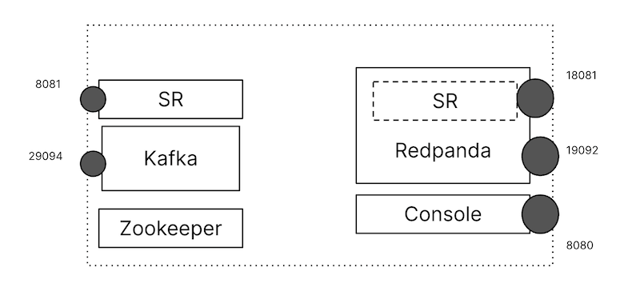
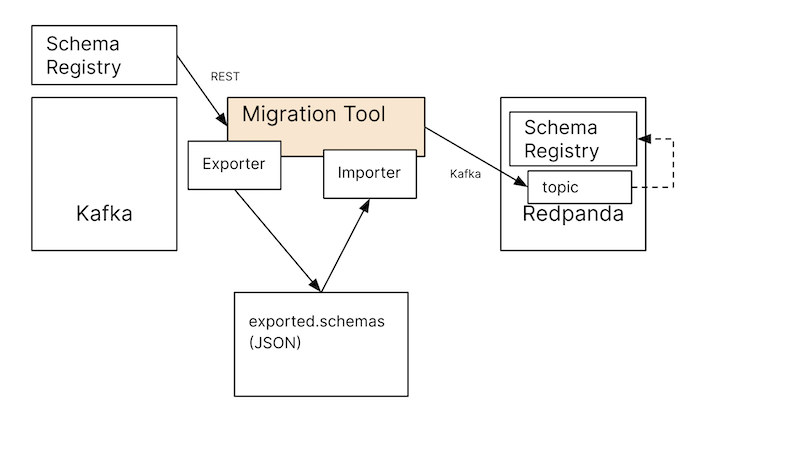
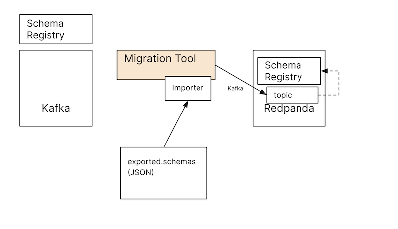
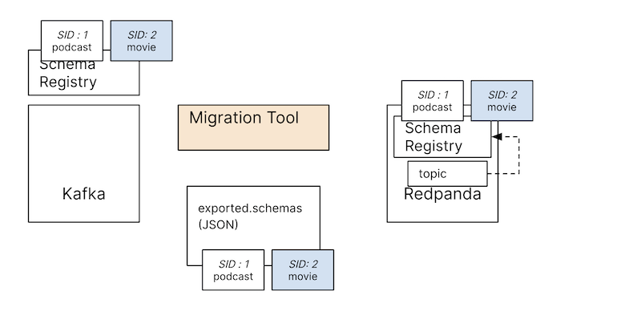
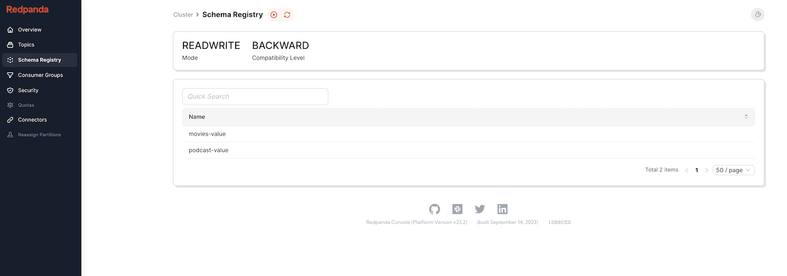
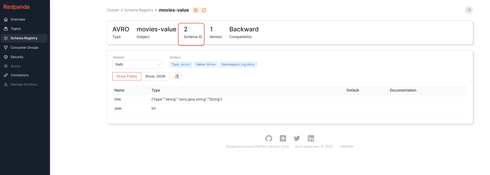

### Start the Redpanda cluster
There are several ways to set up Redpanda; in this guide, we'll focus on using the Docker images. You can quickly get Redpanda clusters up and running with Docker Compose or Kubernetes.



You'll start three services:

**redpanda-0** : This is the Redpanda broker. In this lab, because of limited resources, we're operating with just one broker. But remember, in a real-world setup, you'd have multiple brokers for high availability, fault tolerance, and better scaling. Schema registry is already in the broker,  eliminating the need for additional component installations. And for those managing operations, Redpanda autonomously manages cross-cluster replication.. 

**redpanda-console**: This links to the Redpanda Console, which is the official UI for Redpanda.

Alright, it's time to get these services going. Kick them off with the following command in _tab 1_:
```
cd ~/
docker-compose -f docker-compose-rp.yaml up -d 
```{{exec}}

Please be patient for a moment. You'll know it's done when you see:

```
Creating redpanda-0     ... done
Creating root_connect_1 ... done
Creating redpanda-console ... done
```
Click on [Redpanda Console]({{TRAFFIC_HOST1_8080}}/) and access it via your browser. In the Topics and Schema Registry views, you should see nothing is created indicating this is an empty cluster.


### Migrate schemas

Redpanda has a tool designed to facilitate the transfer of schemas between Schema Registry instances. This tool extracts schemas from the source registry through REST API. Then, it incorporates these schemas into the target instance by posting them as messages to the _schemas topic in Redpanda. Through this method, both version numbers and schema IDs are accurately replicated to the target cluster.




We are going to start by downloading the project from Github:

```
git clone --single-branch --branch masterclass https://github.com/redpanda-data/schema-migration.git
```{{exec}}

Next we are going to create an config file that points to the source registry, and specify the intermediate file that stores exported schemas: 

```
cd schema-migration
cat <<EOF > conf/export.yaml
exporter:
  source:
    url: http://localhost:8081/ # Mandatory
  options:
    exclude.deleted.versions: true # Mandatory
    exclude.deleted.subjects: true # Mandatory
    logfile: export.log # Mandatory

schemas: exported-schemas.txt # Mandatory
EOF
```{{exec}}


Start exporting the schema from the old schema registry:
```
pip3.11 install -r requirements.txt
python3.11 exporter.py --config conf/export.yaml
```{{exec}}

Take a look at the exported file:
```
cat exported-schemas.txt
```{{exec}}

Create an config file that points to the target Redpanda broker, and specify the intermediate file that stores exported schemas: 
```
cat <<EOF > conf/import.yaml
schemas: exported-schemas.txt # Mandatory

importer:
  target:
    bootstrap.servers: localhost:19092 # Mandatory
  options:
    topic: _schemas # Mandatory
    logfile: import.log # Mandatory
EOF
```{{exec}}



Start importing the schema to the new Redpanda schema registry:
```
python3.11 importer.py --config conf/import.yaml
```{{exec}}



Click on [Redpanda Console]({{TRAFFIC_HOST1_8080}}/). When you navigate to the Schema Registry, you should see that all the schemas have been migrated and replicated to the Redpanda schema registry.




>_Note_ the `Schema ID` should match the ID from the original source registry.

