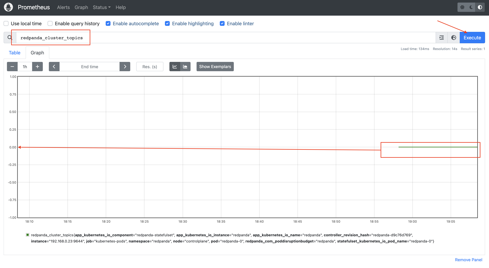
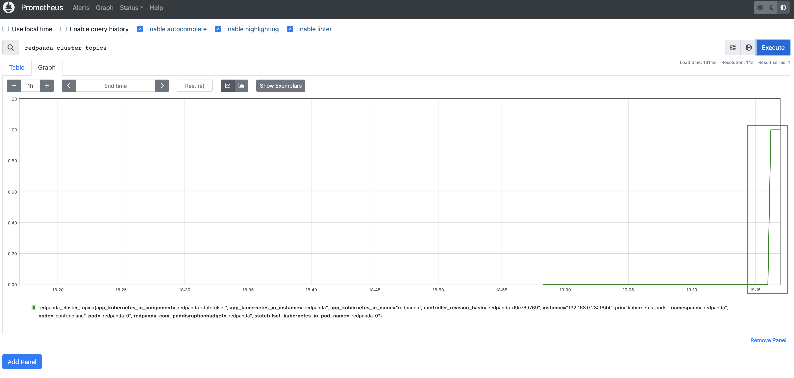
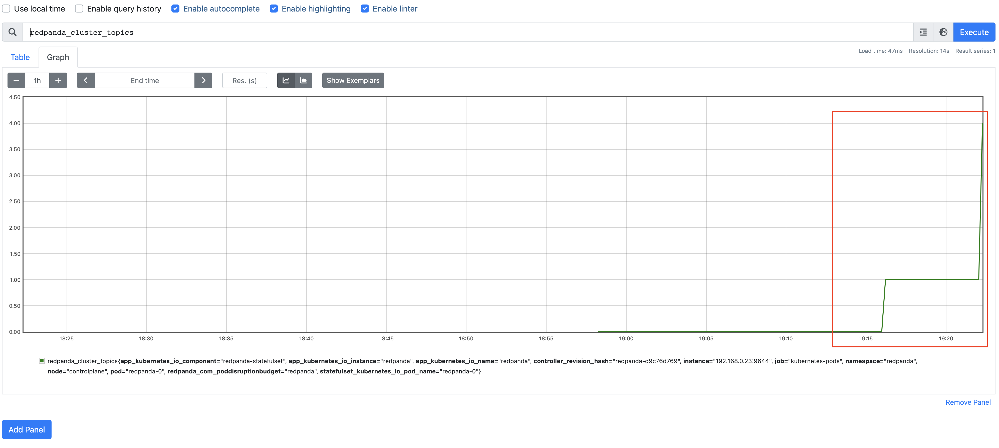

Tools in this tutorial:

- `helm`: This helps you define, install, and upgrade applications running on Kubernetes.
- `kubectl`: The Kubernetes command-line tool lets you deploy applications, inspect and manage cluster resources, and view logs in Kubernetes cluster. 
- `rpk`: The Redpanda command-line tool lets you manage your entire Redpanda cluster, without the need to run a separate script for each function, as with Apache Kafka. The `rpk` commands handle everything from configuring nodes and low-level tuning to high-level general Redpanda tasks. 

Assume you have already deploy the Redpanda cluster in Kubernetes, and everything is running smoothly, so what next? 

Let's take a look around, a Redpanda cluster with one broker has already installed for you on this single node Kubernetes environment.


Run the following command to see what was deployed:

```
kubectl get all --namespace redpanda
```{{exec}}

you'll see a working Redpanda cluster in the _redpanda_ namespace

```
NAME                               READY   STATUS      RESTARTS   AGE
pod/redpanda-0                     2/2     Running     0          37s
pod/redpanda-configuration-4z9kw   0/1     Completed   0          37s

NAME                        TYPE        CLUSTER-IP       EXTERNAL-IP   PORT(S)                                                       AGE
service/redpanda            ClusterIP   None             <none>        9644/TCP                                                      37s
service/redpanda-external   NodePort    10.108.116.179   <none>        9644:31644/TCP,9094:31092/TCP,8083:30082/TCP,8084:30081/TCP   37s

NAME                        READY   AGE
statefulset.apps/redpanda   1/1     37s

NAME                               COMPLETIONS   DURATION   AGE
job.batch/redpanda-configuration   1/1           16s        37s
```


Monitoring Redpanda after installation is crucial for ensuring the health, performance, and stability of your cluster. By monitoring Kafka, you gain valuable insights into its resource utilization, message throughput, and overall system behavior. Prometheus is popularly used for monitoring and alerting in Kubernetes. We will use it to scrapes and collect metrics data from Redpanda cluster.


To install Prometheus with helm chart, add the Prometheus repository:

```
helm repo add prometheus-community https://prometheus-community.github.io/helm-charts  
helm repo update
```{{exec}}


Since this tutorial environment has limited capacity, we will adjust the storage from default 8GB to 2 GB: 
```
cat <<EOF > value.yaml
server:
  name: server
  persistentVolume:
    enabled: true
    accessModes:
      - ReadWriteOnce
    size: 2Gi
EOF
```{{exec}}

Install Prometheus in the monitoring namespace:
```
helm install prometheus prometheus-community/prometheus --namespace monitoring --create-namespace --values value.yaml
```{{exec}}

And check if all service are running correctly: 
```
kubectl get pod --namespace monitoring 
```{{exec}}

Verify that all pods are in the _Running_ state:
```
NAME                                                 READY   STATUS    RESTARTS   AGE
prometheus-alertmanager-0                            1/1     Running   0          48s
prometheus-kube-state-metrics-64b4cd6658-p9bk7       1/1     Running   0          48s
prometheus-prometheus-node-exporter-ljkfj            1/1     Running   0          48s
prometheus-prometheus-pushgateway-7cfd5f66f4-mm7v7   1/1     Running   0          48s
prometheus-server-588d78b546-v99hr                   2/2     Running   0          48s
```

Run the following command to export Prometheus Console:
```
cat <<EOF | kubectl -n monitoring apply -f -
apiVersion: networking.k8s.io/v1
kind: Ingress
metadata:
  name: prometheus-ingress
  annotations:
    ingress.kubernetes.io/rewrite-target: /
spec:
    rules:
    - http:
        paths:
        - backend:
            service:
              name: prometheus-server 
              port:
                number: 80
          path: /
          pathType: ImplementationSpecific
EOF
```{{exec}}


Give it a couple of minutes to start. (Refresh it if you see 503 Service Temporarily Unavailable. This is a very limited cluster.) Click [Prometheus Console]({{TRAFFIC_HOST2_80}}/) to access it in your browser.


(_NOTE_ if you keep getting Error 502 *Bad Gateway*, that probably means the Ingress was hosted on another host in this tutorial env. go to [ACCESS PORTS]({{TRAFFIC_SELECTOR}}) and try click on both 80 port, one of them should work.)


It's not collect data from Redpanda just yet, let's go ahead and add annotations to our Redpanda pods, it allows Prometheus to find and scrape the Redpanda's metrics endpoint:

```
helm upgrade --install redpanda redpanda/redpanda \
  --namespace redpanda \
  --create-namespace \
  --set-string statefulset.annotations."prometheus\.io/scrape"="true",statefulset.annotations."prometheus\.io/path"=public_metrics,statefulset.annotations."prometheus\.io/port"="9644" \
  --reuse-values 
```{{exec}}

It's going to take a minute or two, wait until Redpanda is back on running:

```
kubectl -n redpanda get pod redpanda-0
```{{exec}}

```
NAME         READY   STATUS    RESTARTS   AGE
redpanda-0   2/2     Running   0          8m43s
```
Go back to your [Prometheus Console]({{TRAFFIC_HOST2_80}}/), and in the Expression box, type *redpanda_cluster_topics* and click _Execute_ on the right. And click on Graph tab to see the result:




You should be able to see a line on 0 of the Y axis.

Now let's go ahead and create a new topic,
```
kubectl -n redpanda exec -ti redpanda-0 -c redpanda -- rpk topic create demo-topic
```{{exec}}

You should be prompt with the following success message:
```
TOPIC       STATUS
demo-topic  OK
```

Give it a minute, and go back to the [Prometheus Console]({{TRAFFIC_HOST2_80}}/) and query the same *redpanda_cluster_topics* expression again, you should be able to see the increase of topic number from zero to one now. 



Create a few more, and see the growth of the graph. 

ie.
```
controlplane $ kubectl -n redpanda exec -ti redpanda-0 -c redpanda -- rpk topic create demo1-topic
TOPIC        STATUS
demo1-topic  OK
controlplane $ kubectl -n redpanda exec -ti redpanda-0 -c redpanda -- rpk topic create demo2-topic
TOPIC        STATUS
demo2-topic  OK
controlplane $ kubectl -n redpanda exec -ti redpanda-0 -c redpanda -- rpk topic create demo3-topic
TOPIC        STATUS
demo3-topic  OK
```



Congratulations, you have successfully setup Prometheus and Redpanda to start collecting metrics for monitoring. 


