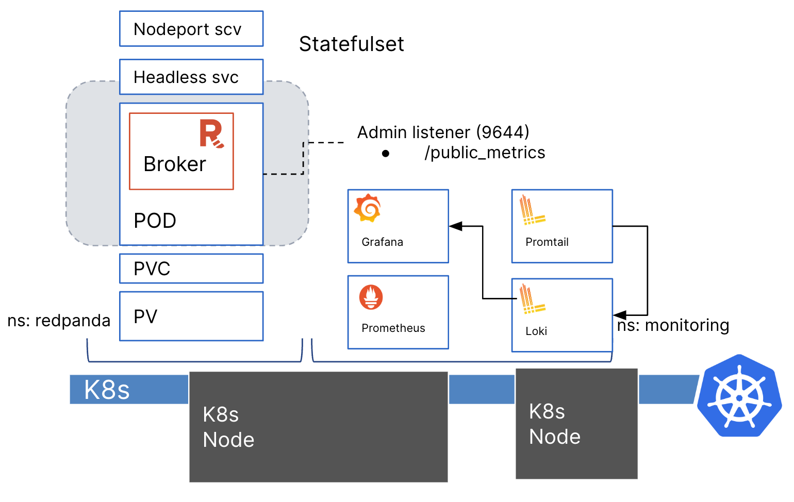
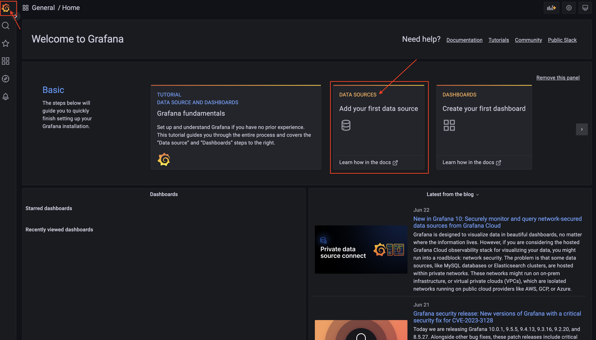
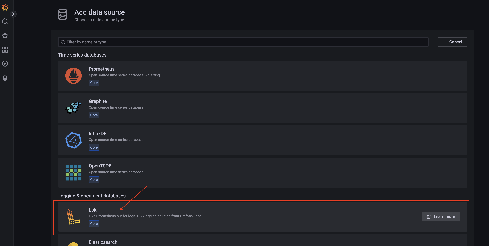
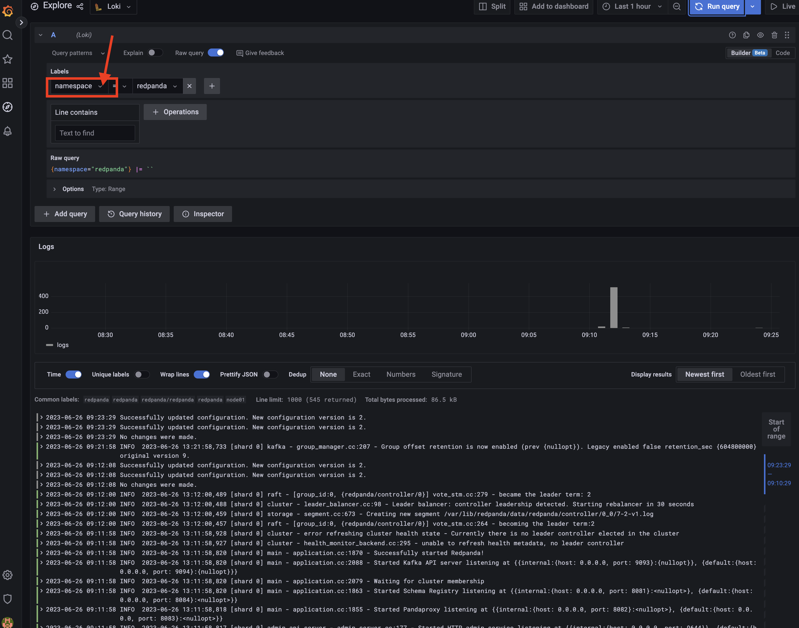

Logging is essential for monitoring Redpanda as it provides valuable insights into the internal workings and behavior of the cluster. By analyzing the logs, you can identify and troubleshoot issues, track performance metrics, detect anomalies, and gain a deeper understanding of the system's operations.

Here is what your environment will look like, notice we are adding both Loki & Promtail under the same _monitoring_ namespace.


*Promtail* is a component used for log collection and forwarding. It sends the logs to a centralized log aggregator, allowing for centralized log management and analysis.

*Loki* the log aggregator that enables the collection, indexing, and storage of logs in a highly scalable and efficient manner. Allows users to easily search, explore, and analyze logs.

We will use the Helm chart to install both Promtail & Loki:
```
helm repo add grafana https://grafana.github.io/helm-charts
helm -n monitoring  install loki grafana/loki-stack --set grafana.enabled=false
```{{exec}}

Verify if both Promtail and Loki are up and running, 
```
kubectl -n monitoring get pod
```{{exec}}

Wait until all pods are in running state:
```
NAME                                                 READY   STATUS    RESTARTS      AGE
loki-0                                               1/1     Running   0             115s
loki-promtail-p9q5q                                  1/1     Running   0             115s
```

The Promtail agent that we've installed is at the host level and is configured to scrape the all logs in the cluster. This means you can directly head to the Explore menu to check the logs of your pods, click on the Logo on the left menu, and select the _Add your data source_ tab to add Loki as the data source to explore:



Select Loki to continue: 


Configure the data source by pointing to the Loki service that returns the collected logs. The service is available in the monitoring namespace:
```
kubectl -n monitoring get svc | grep loki
```{{exec}}

Set URL to *http://loki:3100* and click on the Save & Test button.


Now it's time to explore the logs, in the left menu, click on the Explore to access the Explore panel:


Select Loki as the data source on the top of the page:


Try and filter the log to view by setting the label to {container=redpanda} and click on _Run Query_:


You can further analyze the log by looking up the keywords,type in *raft* and click on _Run Query_:


Try broaden the search to view by setting the label to {namespace=redpanda} and click on _Run Query_:


 Congratulations, you have successfully setup Loki & Promtail to view metrics for monitoring Redpanda. 