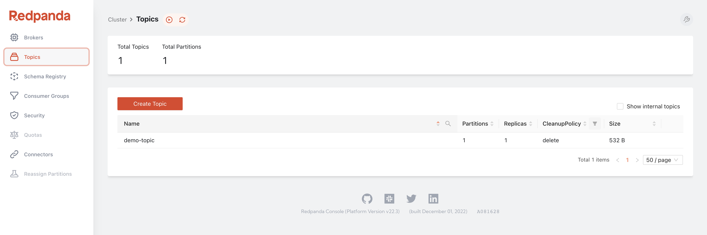

Updating and patching a Redpanda cluster is fairly straightforward with helm.
We can use the parameter like how we deploy the cluster in step one, or we can create a YAML file to indicate the new settings.

In this step, we will be adding and spin up the *Redpanda Console*. Redpanda Console is a developer-friendly UI for managing your the workloads. In this setting, you can see that we have enable the console to deploy as well as setup an ingress endpoint, so we can access the console externally.  


```
cat <<EOF > value.yaml
console:
  enabled: true
  ingress:
    enabled: true
    hosts:
    - paths:
        - path: /
          pathType: ImplementationSpecific
EOF
```{{exec}}

Kick start helm and upgrades a release with the new changes in setting. 

```
helm upgrade --install redpanda redpanda/redpanda \
    --namespace redpanda --create-namespace \
    --values value.yaml --reuse-values

```{{exec}}

Give it a minute or two, your console should be deploy and ready. 

```
kubectl -n redpanda get pod
```{{exec}}

Where you will see the redpanda-console pod running. 

```
NAME                                READY   STATUS      RESTARTS   AGE
redpanda-0                          1/1     Running     0          2m29s
redpanda-configuration-w5kj8        0/1     Completed   0          31s
redpanda-console-5d77c44b95-wf6kg   1/1     Running     0          31s
redpanda-post-upgrade-2l5xg         0/1     Completed   0          25s
```

Check if you see an ingress endpoint installed, 

```
kubectl -n redpanda get ingress
```{{exec}}

It should be bind to an 80 port.
```
NAME               CLASS    HOSTS   ADDRESS     PORTS   AGE
redpanda-console   <none>   *       localhost   80      26m
```

Give it a couple of minutes to start, (refresh if you see 503 Service Temporarily Unavailable! This is super limited cluster)
Click [Redpanda Console]({{TRAFFIC_HOST1_80}}/) to access it via your browser.
You'll see the _demo-topic_ we've created in Step 2.


Click into the topic, where all event streamed is displayed.


Congratulations you have completed this tutorial with all components installed. 


Happy Streaming!